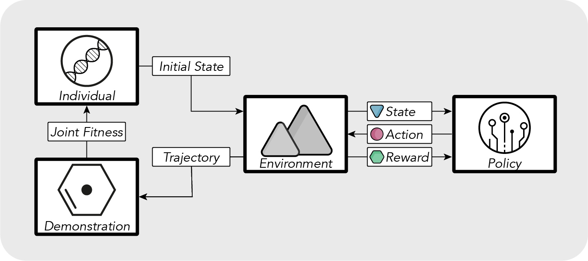
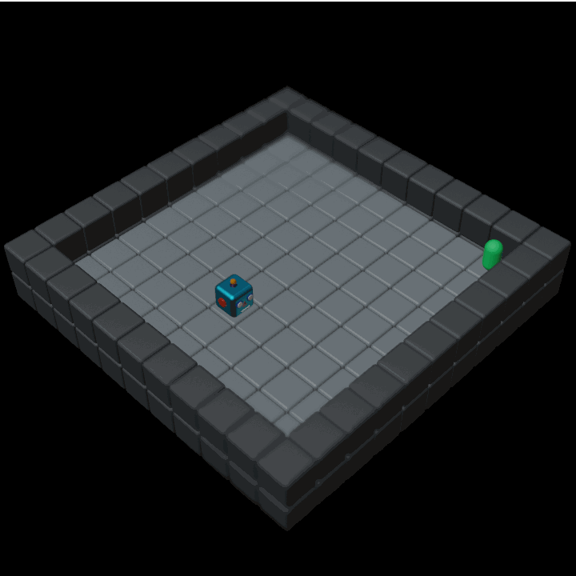
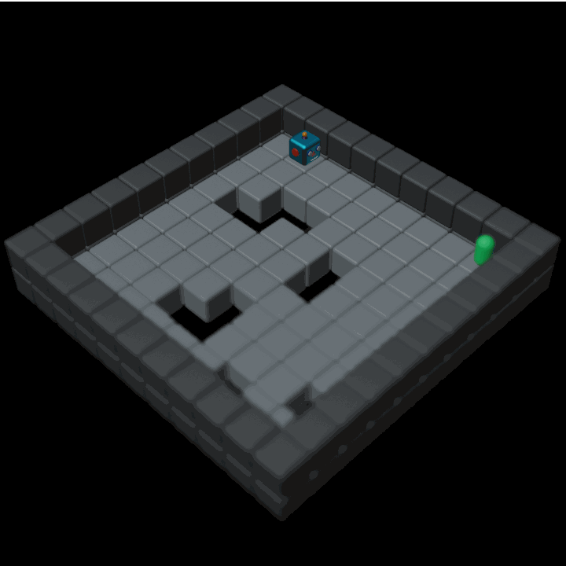
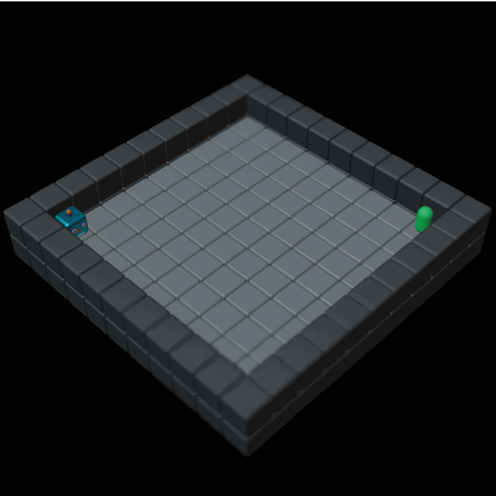
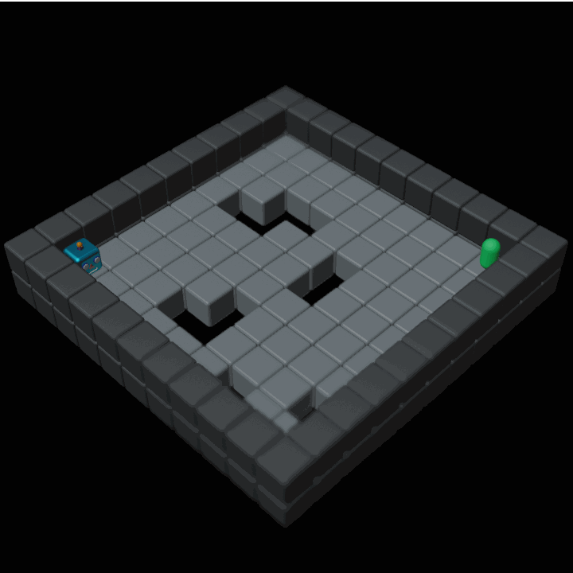
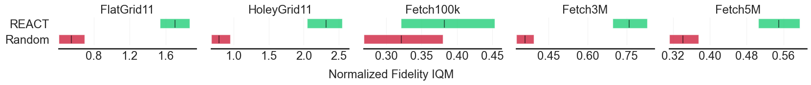

# REACT - Revealing Evolutionary Action Consequence Trajectories for Interpretable Reinforcement Learning

[](https://arxiv.org/pdf/2404.03359)



## REACT Demonstrations

### Flat and Holey Gridworlds

Demo  | FlatGrid (PPO 35k steps) | HoleyGrid (PPO 150k steps)
:---- |:-----------------------:|:--------------------------:
REACT |  | 
Train |  | 

### Continous Robot Control

Demo  | FetchReach (SAC 100k steps) | FetchReach (SAC 3M steps) | FetchReach (SAC 5M steps)
:---- |:---------------------------:|:-------------------------:|:-------------------------:
REACT |  |  | 
Train |  |  | 

### Demonstration Fidelity



## Reproduce Results

### Setup

Clone this repository and run `pip install -e .` to install this project in editable mode.

### Paramters

env_name    | steps    | trainseed | model | pop_size | iterations | enconding_length | plot_frequency
----------- | -------: | :-------: | ----- | -------- | ---------- | ---------------- | --------------
FlatGrid11  | 35000    | 42        | ppo   | 10       | 40         | 6                | 10
HoleyGrid11 | 150000   | 33        | ppo   | 10       | 40         | 6                | 10
FetchReach  | 100000   | 42        | sac   | 30       | 1000       | 9                | 100
FetchReach  | 3000000  | 42        | sac   | 30       | 1000       | 9                | 100
FetchReach  | 5000000  | 42        | sac   | 30       | 1000       | 9                | 100

### Random Seeds

For evaluation we used the following seeds: `42, 13, 24, 18, 46, 19, 28, 32, 91, 12`

To reproduce all seeds run:

```sh
./scripts/{{env_name}}/run_react.sh
./scripts/{{env_name}}/run_random.sh
./scripts/{{env_name}}/run_eval.sh
```

To reproduce plots with a single run, use seed 42.

### Train the policy

```sh
react train --env-name {{env_name}} --name train --model {{model}} --steps {{steps}} --seed [trainseed]
```

### Evaluate the resulting policy

```sh
react run --env-name {{env_name}} --saved-model train_{{model}} --checkpoint {{steps}} --seed {{seed}} 
```

Videos are saved to `experiments/videos`.

### Optimize REACT demonstrations

```sh
react evo --env-name {{env_name}} --saved-model train_{{model}} --checkpoint {{steps}} --name {{env_name}}-0 --seed {{seed}} --pop-size {{pop_size}} --iterations {{iterations}} --encoding-length {{enconding_length}} --plot-frequency {{plot_frequency}}  --is-elitist  --crossover 0.75 --mutation 0.5
```

To view the resulting demonstrations run:

```sh
react eval --env-name {{env_name}} --exp-name {{env_name}}-{{seed}} --saved-model train_{{model}} --checkpoint {{steps}} --seed {{trainseed}} --render
```

To compare the results with random search run:

```sh
react baseline1 --env-name {{env_name}} --saved-model train1_{{model}} --checkpoint {{steps}} --pop-size {{pop_size}} --iterations 1 --encoding-length {{encoding_length}} --name FlatGrid11 --seed {{trainseed}} --plot
```

## Command Reference

### Training

`react train` to train the agent

* `--env-name`: name of the environment, either "FlatGrid11", "HoleyGrid11" or "FetchReach"
* `--name`: name of the model to train, defines where to find the saved model and logs
* `--model`: name of the model to use (ppo, sac, ...)
* `--render`: to render the environment
* `--steps`: number of steps to train for
* `--save-freq`: the save frequency of checkpoints, if not defined there are no checkpoints saved
* `--env-seed`: seed for initializing the environments layout in HoleyGrid

#### Running a trained model

`react run` to run a previously trained model

* `--env-name`: name of the environment, either "FlatGrid11", "HoleyGrid11" or "FetchReach"
* `--saved-model`: name of the trained model to run (e.g. "train1_ppo")
* `--nr-episodes`: number of episodes to run the model for, default is 5
* `--checkpoint`: which models saved checkpoint should be used,  without this parameter a model without checkpoints is used
* `--env-seed`: seed for initializing the environments layout in HoleyGrid

### Run REACT

`react evo` to run the evolutionary algorithm on the trained model

* `--env-name`: name of the environment, either "FlatGrid11", "HoleyGrid11" or "FetchReach"
* `--saved-model`: name of the trained model (e.g. "train1_ppo")
* `--render`: should render the environment
* `--pop-size`: size of the population
* `--iterations`: number of iterations to run the algorithm for
* `--crossover`: crossover probability
* `--mutation`: mutation probability
* `--name`: experiment name
* `--is-elitist`: keep strongest individuals in population
* `--plot-frequency`: how often the metrics should be plotted
* `--checkpoint`: which models saved checkpoint should be used, without this parameter a model without checkpoints is used
* `--encoding-length`: encoding length to use
* `--env-seed`: seed for initializing the environments layout in HoleyGrid
* `--seed`: seed to run the genetic algorithm with

### Evalaute

`react eval` to see the last generation of an experiment

* `--env-name`: name of the environment, either "FlatGrid11", "HoleyGrid11" or "FetchReach"
* `--saved-model`: name of the trained model (e.g. "train1_ppo")
* `--exp-name`: name of the experiment
* `--checkpoint`: which models saved checkpoint should be used, without this parameter a model without checkpoints is used
* `--env-seed`: seed for initializing the environments layout in HoleyGrid
* `--render`: to render the environment
* `--plot`: to plot the 3D-trajectories of FetchReach

`react baseline1` to run the random search baseline

* `--env-name`: name of the environment, either "FlatGrid11", "HoleyGrid11" or "FetchReach"
* `--saved-model`: name of the trained model (e.g. "train1_ppo")
* `--pop-size`: size of the population
* `--iterations`: number of iterations to run the algorithm for
* `--name`: experiment name
* `--checkpoint`: which models saved checkpoint should be used, without this parameter a model without checkpoints is used
* `--encoding-length`: encoding length to use
* `--env-seed`: seed for initializing the environments layout in HoleyGrid
* `--seed`: seed to perform random search with
* `--plot`: flag to plot 3D-histogram or 3D-trajectories

## Appendix

Additional evaluations can be found [here](Appendix.pdf).
