# Surrogate Fitness Metrics for Interpretable Reinforcement Learning

[](https://doi.org/10.5220/0013005900003837)
[](https://www.scitepress.org/Papers/2024/130059/130059.pdf)

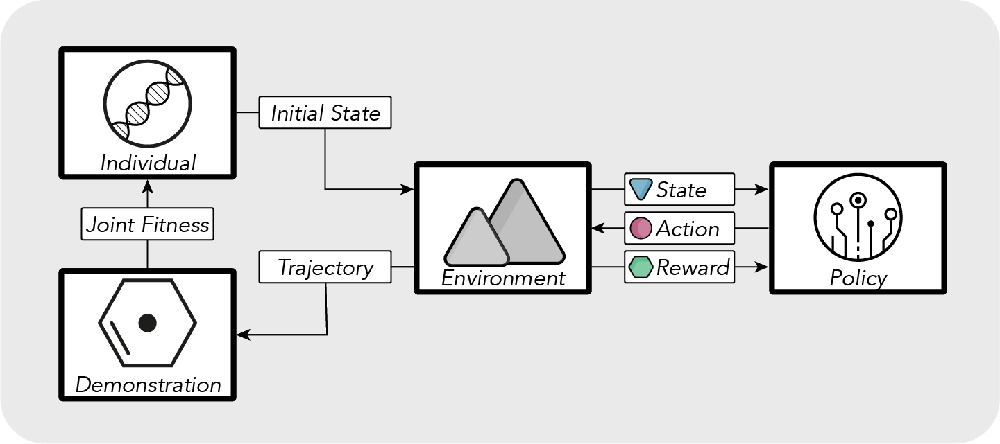

## REACT Demonstrations

### FlatGrid11 (PPO trained for 35k steps)

REACT | Fidelity | Random | Train
:-----:|:--------:|:------:|:-----:
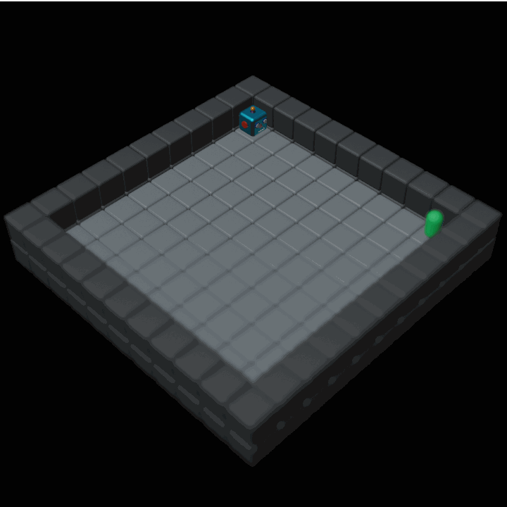 | 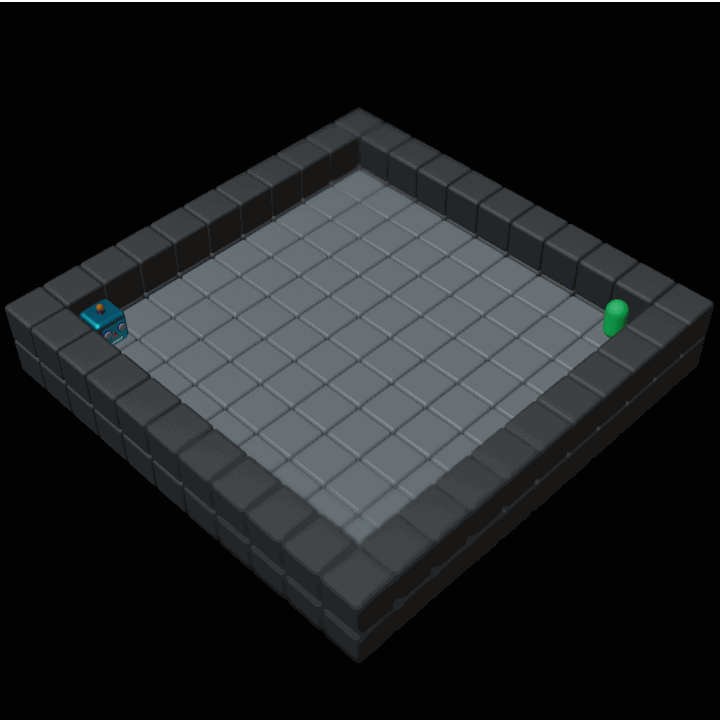 | 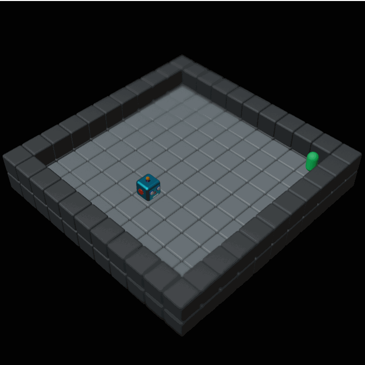 | 
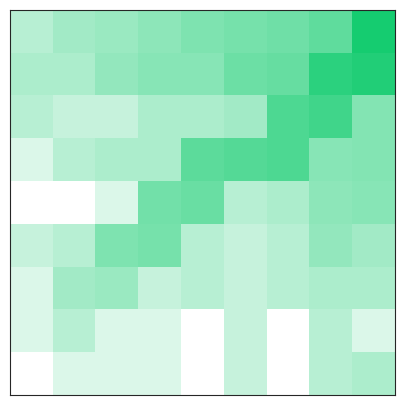 | 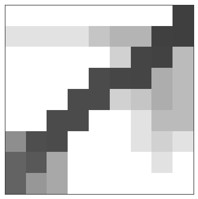 | 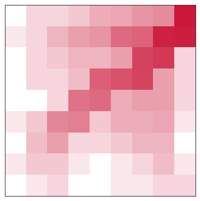 | -

### HoleyGrid11 (PPO trained for 150k steps)

REACT | Fidelity | Random | Train
:-----:|:--------:|:------:|:-----:
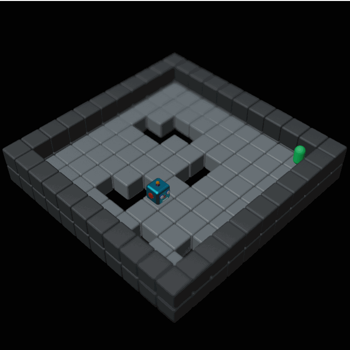 | 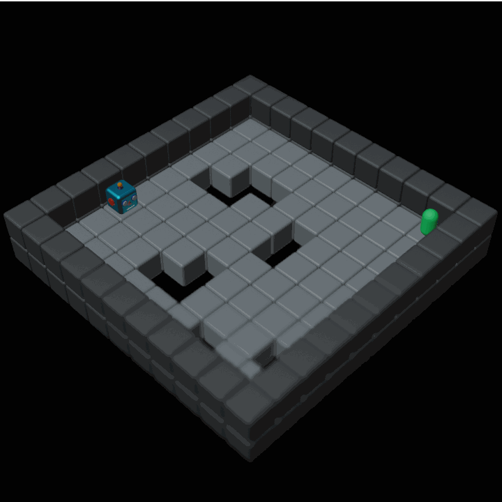 |  | 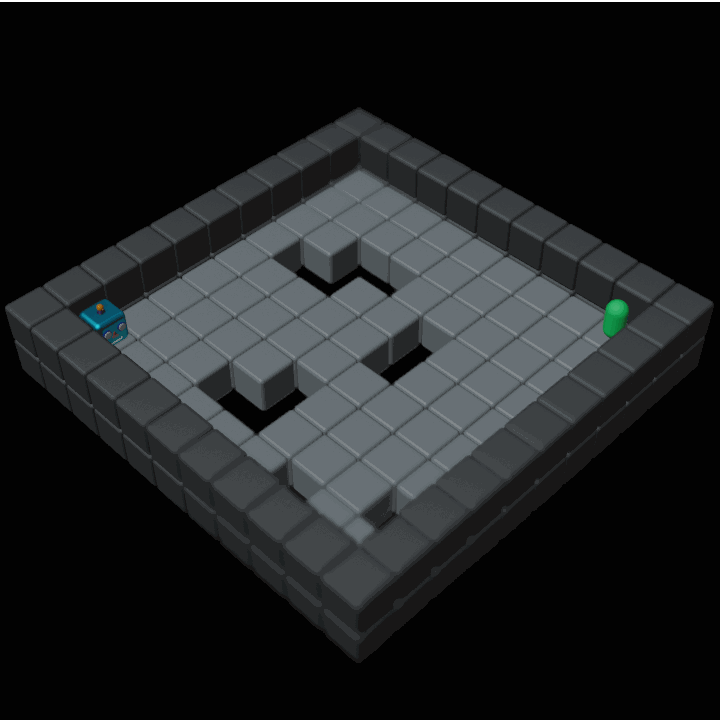
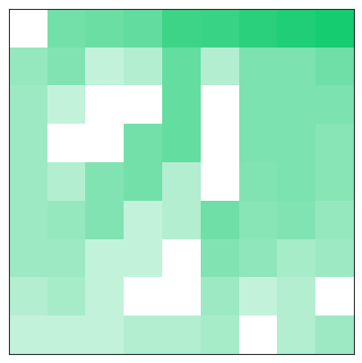 | 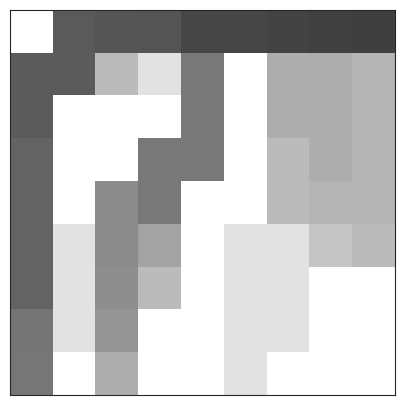 | 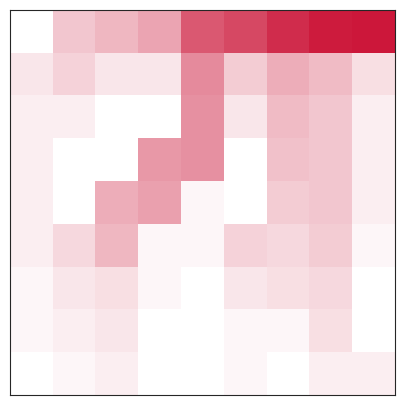 | -

### Continous Robot Control

Training   | REACT | Fidelity | Random | Train | Trajectories
:----------|:-----:|:--------:|:------:|:-----:|:------------
SAC (50k) |  |  |  | 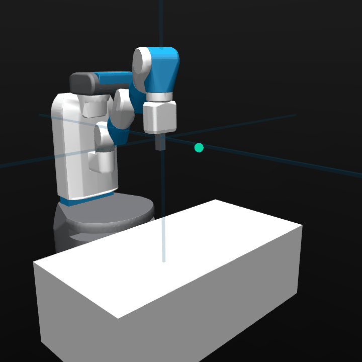 | 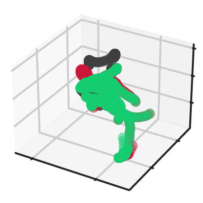
SAC (100k) |  | 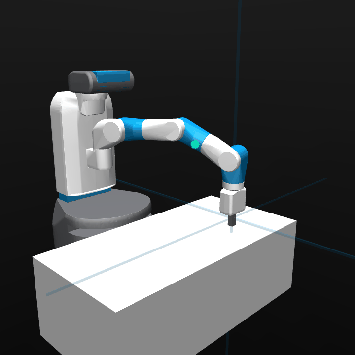 |  |  | 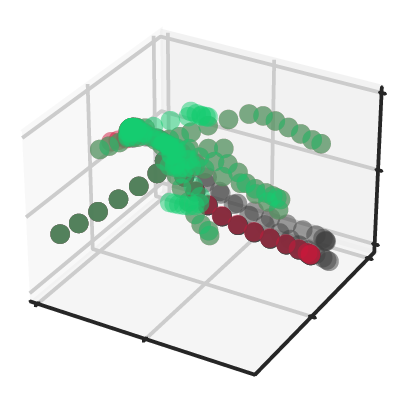
SAC (150k) | 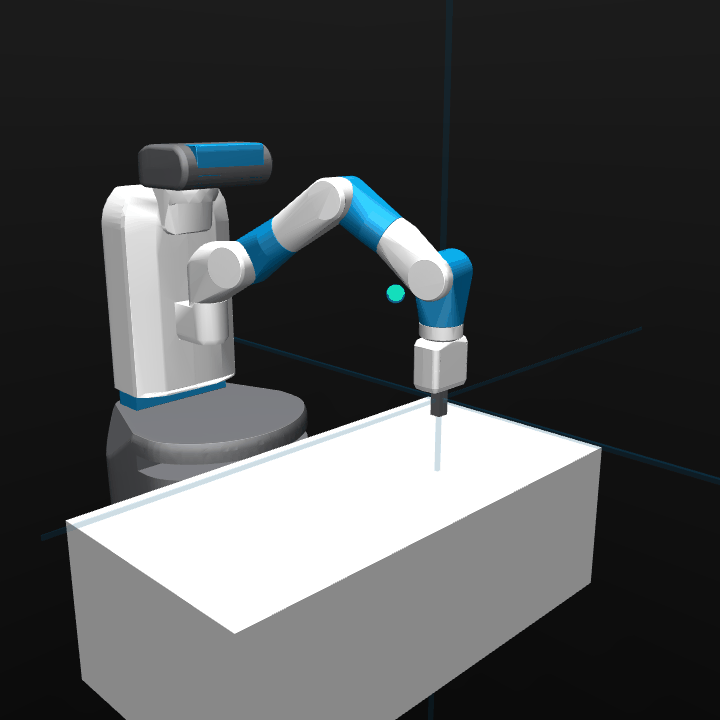 | 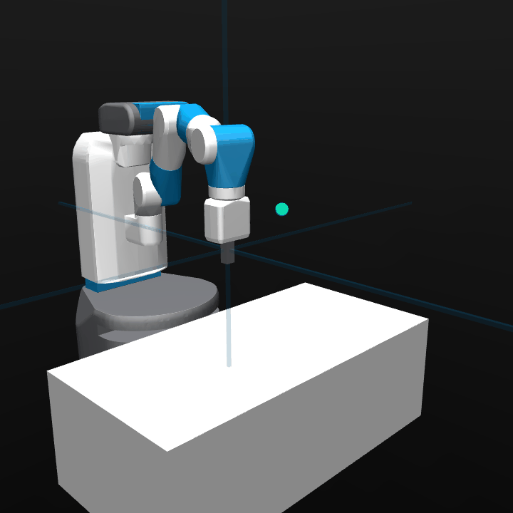 |  |  | 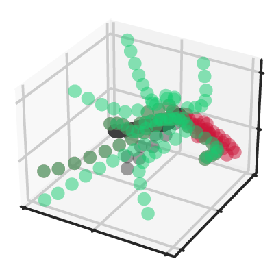

For further evaluation results regarding the resuling demonstration fidelity, reward optimality gap, and comparisons of different fitness particles and their influence, please refer to the full paper.

## Reproduce Results

### Setup

Clone this repository and run `pip install -e .` to install this project in editable mode.

### Paramters

env_name    | steps  | trainseed | model | pop_size | iterations | enconding_length
----------- | -----: | :-------: | ----- | -------- | ---------- | ----------------
FlatGrid11  | 35000  | 42        | PPO   | 10       | 40         | 6
HoleyGrid11 | 150000 | 33        | PPO   | 10       | 40         | 6
FetchReach  | 50000  | 42        | SAC   | 10       | 40         | 9
FetchReach  | 100000 | 42        | SAC   | 10       | 40         | 9
FetchReach  | 150000 | 42        | SAC   | 10       | 40         | 9

### Train the evaluated policy

```sh
react train --env-name {{env_name}} --name train --model {{model}} --steps {{steps}} --env-seed [trainseed]
```

models and videos are saved to `experiments/model/<env_name>`

### Evaluate the resulting policy

```sh
react run --env-name {{env_name}} --saved-model train_{{model}} --checkpoint {{steps}} --seed {{seed}} 
```

Videos are saved to `experiments/videos`.

### Optimize REACT demonstrations

```sh
react evo --env-name {{env_name}} --saved-model train_{{model}} --checkpoint {{steps}} --name {{env_name}}-0 --seed {{seed}} --pop-size {{pop_size}} --iterations {{iterations}} --encoding-length {{enconding_length}} --plot-frequency {{plot_frequency}}  --is-elitist  --crossover 0.75 --mutation 0.5
```

To view the resulting demonstrations run:

```sh
react plot --env-name {{env_name}} --exp-name {{env_name}} --saved-model train_{{model}} --checkpoint {{steps}} --render
```

To compare the results with random search run:

```sh
react baseline1 --env-name {{env_name}} --saved-model train1_{{model}} --checkpoint {{steps}} --pop-size {{pop_size}} --iterations 1 --encoding-length {{encoding_length}} --name FlatGrid11 --seed {{trainseed}} --plot
```

### Random Seeds

For evaluation we used the following seeds: `42, 13, 24, 18, 46, 19, 28, 32, 91, 12`

To reproduce all seeds run:

```sh
./scripts/{{env_name}}/run_train.sh
./scripts/{{env_name}}/run_react.sh
./scripts/{{env_name}}/run_ablations.sh
```

To reproduce the plots, use:

```sh
react plot --env-name FlatGrid11 --render 
react plot --env-name HoleyGrid11 --render 
react plot --env-name Fetch50k --render 
react plot --env-name Fetch100k --render 
react plot --env-name Fetch150k --render --training
```

## CLI Reference

### Training

`react train` to train the agent

* `--env-name`: name of the environment, either "FlatGrid11", "HoleyGrid11" or "FetchReach"
* `--name`: name of the model to train, defines where to find the saved model and logs
* `--model`: name of the model to use (ppo, sac, ...)
* `--render`: to render the environment
* `--steps`: number of steps to train for
* `--save-freq`: the save frequency of checkpoints, if not defined there are no checkpoints saved
* `--env-seed`: seed for initializing the environments layout in HoleyGrid

#### Running a trained model

`react run` to run a previously trained model

* `--env-name`: name of the environment, either "FlatGrid11", "HoleyGrid11" or "FetchReach"
* `--saved-model`: name of the trained model to run (e.g. "train1_ppo")
* `--nr-episodes`: number of episodes to run the model for, default is 5
* `--checkpoint`: which models saved checkpoint should be used,  without this parameter a model without checkpoints is used
* `--env-seed`: seed for initializing the environments layout in HoleyGrid

### Run REACT

`react evo` to run the evolutionary algorithm on the trained model

* `--env-name`: name of the environment, either "FlatGrid11", "HoleyGrid11" or "FetchReach"
* `--saved-model`: name of the trained model (e.g. "train1_ppo")
* `--render`: to render the environment
* `--pop-size`: size of the population
* `--iterations`: number of iterations to run the algorithm for (0 for Random)
* `--crossover`: crossover probability
* `--mutation`: mutation probability
* `--name`: experiment name (used for saving logs and plotting)
* `--is-elitist`: keep strongest individuals in population
* `--plot-frequency`: how often the metrics should be plotted (0 for no plotting)
* `--checkpoint`: which models saved checkpoint should be used, without this parameter a model without checkpoints is used
* `--encoding-length`: encoding length to use
* `--env-seed`: seed for initializing the environments layout in HoleyGrid
* `--seed`: seed to run the genetic algorithm with
* `w1`: Weight for global diversity
* `w2`: Weight for local diversity
* `w3`: Weight for certainty
* `w4`: Weight for local min distance

These weights (w1,w2,w3,w4) allow the configuration of various ablations:

* (1,1,1,1): REACT
* (1,0,0,0): REACT_G (Global diversity only)
* (0,1,1,1): REACT_D (Min Local Distance)
* (1,1,1,0): REACT_P (Simple Sum, No distance)
* (0,1,0,0): REACT_L (Local Diversity only)
* (0,0,1,0): REACT_C (Certainty only)
* (0,0,0,0): REACT_F (Fidelity fitness)

### Plot results

`react plot` to generate the plots found in the paper.

* `--env-name`: name of the experiment to plot (*FlatGrid11*, *HoleyGrid11*, *Fetch50k*, *Fetch100k*, *Fetch150k*)
* `--render`: to render the trajectories generated from a singel random seed for REACT, REACT_F and Random

### Acknowledgements

An earlier version of this work was presented at the International Conference on Evolutionary Computation Theory and Applications (ECTA 2024) [1]. This work extends our conference paper with a thorough hyperparameter analysis, ablation studies investigating the impact of partial- and fidelity-based rewards, as well as a more robust assessment of the generated trajectories in terms of their optimality
gap and demostration fidelities.

[1] Philipp Altmann, Céline Davignon, Maximilian Zorn, Fabian Ritz, Claudia Linnhoff-Popien, and Thomas Gabor, "REACT: Revealing Evolutionary Action Consequence Trajectories for Interpretable Reinforcement Learning", in *Proceedings of the 16th International Joint Conference on Computational Intelligence*, IJCCI '24, pp. 127-138, 2024.
